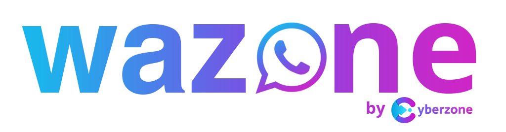

<a name="readme-top"></a>

<!-- PROJECT LOGO -->
<br />
<div align="center">
  <a href="https://github.com/kim-dev-git/WAZone-Web">
    
  </a>

<h3 align="center">WAZONE - Web</h3>

  <p align="center">
    This project was created to fulfill the job acceptance test at KreatifIndo
    <br />
    <a href="https://github.com/kim-dev-git/WAZone-Web"><strong>Explore the docs »</strong></a>
    <br />
    <br />
    <a href="https://github.com/kim-dev-git/WAZone-Web">View Demo</a>
    ·
    <a href="https://github.com/kim-dev-git/WAZone-Web/issues">Report Bug</a>
    ·
    <a href="https://github.com/kim-dev-git/WAZone-Web/issues">Request Feature</a>
  </p>
</div>


<!-- TABLE OF CONTENTS -->
<details>
  <summary>Table of Contents</summary>
  <ol>
    <li>
      <a href="#about-the-project">About The Project</a>
      <ul>
        <li><a href="#built-with">Built With</a></li>
        <li><a href="#challenges">Challenges</a></li>
        <li><a href="#feature-to-implement-in-the-future">Feature To Implement In The Future</a></li>
      </ul>
    </li>
    <li>
      <a href="#getting-started">Getting Started</a>
      <ul>
        <li><a href="#prerequisites">Prerequisites</a></li>
        <li><a href="#installation">Installation</a></li>
      </ul>
    </li>
    <li><a href="#features">Features</a></li>
    <li><a href="#contact">Contact</a></li>
  </ol>
</details>


<!-- ABOUT THE PROJECT -->
## About The Project

[![WAZONE Screen Shot][send-and-receive-message]](https://github.com/kim-dev-git/WAZone-Web)

### Goal

Build Web App to consume/visualize [this API/Service](https://github.com/kim-dev-git/WAZone-Server):
* Use all the API Endpoint
* Show received WhatsApp message
* Send received WhatsApp message
* Get WhatsApp contacts
* Able to login Multi Device

<p align="right">(<a href="#readme-top">back to top</a>)</p>


### Built With

* [![Vue][Vue.js]][Vue-url]
* [![Vite][Vite.js]][Vite-url]
* [![Vuetify][Vuetify.js]][Vuetify-url]
* [![Typescript][Typescript.js]][Typescript-url]

<p align="right">(<a href="#readme-top">back to top</a>)</p>

### Challenges

* I'am imitating WhatsApp Desktop layout so the UX feel familiar.
* Receiving new message to feel it like realtime quiet tricky without socket. I'am using recursive function to fetch data repeatedly and using Promise setTimeout for delaying the function.

<p align="right">(<a href="#readme-top">back to top</a>)</p>

### Feature To Implement In The Future

- [ ] Implement socket for realtime update.
- [ ] Implement API Key using JWT to identify `botId` (currently using `x-bot-id` on headers.
- [ ] Notification/toast for new message received.
- [ ] Implement push message for notification while tab/browser not focused.

<p align="right">(<a href="#readme-top">back to top</a>)</p>

<!-- GETTING STARTED -->
## Getting Started

Step or instructions on setting up the project locally.
To get a local copy up and running follow these simple example steps.

### Prerequisites

* Node 16^

### Installation

1. Clone the repo
   ```sh
   git clone https://github.com/kim-dev-git/WAZone-Web.git
   ```
2. Open the project folder
    ```sh
    cd WAZone-Web
    ```
3. Install NPM packages
   ```sh
   npm install
   ```
4. For the `.env` file you can create or copy it from`.env.example`
   ```env
   VITE_HEADER_KEY=x-bot-id
   ```
5. Run project
   ```sh
   npm run dev
   ```

<p align="right">(<a href="#readme-top">back to top</a>)</p>

## Features

#### Create custom bot name

[![Create Custom Bot Name Screen Shot][create-custom-bot-name]](https://example.com)


#### Scan QR and Multi Device Login


[![Scan QR and Multi Device Login Screen Shot][scan-qr-and-multi-device-login]](https://example.com)


#### List Contacts & Chats


[![List Contacts & Chats Screen Shot][contact-and-chat-list]](https://example.com)


#### Send & Receive Messages

[![Send & Receive Message Screen Shot][send-and-receive-message]](https://example.com)

<p align="right">(<a href="#readme-top">back to top</a>)</p>


<!-- CONTACT -->
## Contact

Kiki Irwan Maulana - kiki.im.dev@gmail.com

Project Link: [https://github.com/kim-dev-git/WAZone-Web](https://github.com/kim-dev-git/WAZone-Web)

<p align="right">(<a href="#readme-top">back to top</a>)</p>


<!-- MARKDOWN LINKS & IMAGES -->
<!-- https://www.markdownguide.org/basic-syntax/#reference-style-links -->
[contributors-shield]: https://img.shields.io/github/contributors/kim-dev-git/WAZone-Web.svg?style=for-the-badge
[contributors-url]: https://github.com/kim-dev-git/WAZone-Web/graphs/contributors
[forks-shield]: https://img.shields.io/github/forks/kim-dev-git/WAZone-Web.svg?style=for-the-badge
[forks-url]: https://github.com/kim-dev-git/WAZone-Web/network/members
[stars-shield]: https://img.shields.io/github/stars/kim-dev-git/WAZone-Web.svg?style=for-the-badge
[stars-url]: https://github.com/kim-dev-git/WAZone-Web/stargazers
[issues-shield]: https://img.shields.io/github/issues/kim-dev-git/WAZone-Web.svg?style=for-the-badge
[issues-url]: https://github.com/kim-dev-git/WAZone-Web/issues
[license-shield]: https://img.shields.io/github/license/kim-dev-git/WAZone-Web.svg?style=for-the-badge
[license-url]: https://github.com/kim-dev-git/WAZone-Web/blob/master/LICENSE.txt
[linkedin-shield]: https://img.shields.io/badge/-LinkedIn-black.svg?style=for-the-badge&logo=linkedin&colorB=555
[linkedin-url]: https://linkedin.com/in/linkedin_username
[product-screenshot]: images/screenshot.png
[logo]: docs/logo.png
[contact-and-chat-list]: docs/contact-and-chat-list.png
[create-custom-bot-name]: docs/create-custom-bot-name.png
[scan-qr-and-multi-device-login]: docs/scan-qr-and-multi-device-login.png
[send-and-receive-message]: docs/send-and-receive-message.png
[Express.js]: https://img.shields.io/badge/Express-35495E?style=for-the-badge&logo=express&logoColor=4FC08D
[Express-url]: https://express.org/
[TypeORM.js]: https://img.shields.io/badge/Type_ORM-35495E?style=for-the-badge&logo=typeorm&logoColor=4FC08D
[TypeORM-url]: https://typeorm.io/
[Baileys.js]: https://img.shields.io/badge/Baileys-35495E?style=for-the-badge&logo=baileys&logoColor=4FC08D
[Baileys-url]: https://github.com/adiwajshing/Baileys
[Node.js]: https://img.shields.io/badge/Node-35495E?style=for-the-badge&logo=nodedotjs&logoColor=4FC08D
[Node-url]: https://nodejs.org/
[Vue.js]: https://img.shields.io/badge/Vue_3-35495E?style=for-the-badge&logo=vuedotjs&logoColor=4FC08D
[Vue-url]: https://vuejs.org/
[Vite.js]: https://img.shields.io/badge/Vite-35495E?style=for-the-badge&logo=vite&logoColor=4FC08D
[Vite-url]: https://vite.org/
[Typescript.js]: https://img.shields.io/badge/Typescript-35495E?style=for-the-badge&logo=typescript&logoColor=4FC08D
[Typescript-url]: https://typescript.org/
[Vuetify.js]: https://img.shields.io/badge/Vuetify-35495E?style=for-the-badge&logo=vuetify&logoColor=4FC08D
[Vuetify-url]: https://next.vuetifyjs.com
